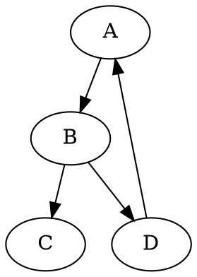

# Forecasting interest rates
real or nominal rates?
how to forecast expected inflation?
Challenges for statistical models: regime shifts, lower bound, backward-looking data and forward-looking rates,...

# expected inflation
TIPS (treasury inflation protection security) against nominal treasuries
principal is indexed to CPI
quoted rate is a real rate

TIPS is much more volatile than the inflation estimate
liluquidity premium and inflation risk premium

# TOPIC 4: 
Part 1:  forward, futures, and RPs
1) Forward Contract
specifies a future transaction: what, quantity, when, price
2) forward rate
the rate(YTM) impled in a future contract

3) buyer: long position
4) hedge: reduces the risk
5) futures contract is a special kind of forward contract
standardized, subject to special rules, liquidity!

Forward price and spot price for bonds:
$$
P_{0}=F_{t} /\left(1+Y_{t}\right) t
$$

forward price approaching cash price
page 11 to see how the forward price is calculated
discount cash flows to the time of "delivery" using forward rate from delivery time to the cash flows

## Repurchase Agreements
short term loan
borrower: enter a repo
lender: reverse

fed: opposite vocabulary

borrower: sell(loan amount) securities to lender, and agreed to buy the same securities back from lender at a specified future date and price(face value)

lender can sell the sec! but she has to "return" at the specidied time

best sec: US treasury

"haircut"
> borrower risk: lender default and the security price gone up...

why there are episode that haircut is high and less liquid? could be regulation

### USE of RPs
short term borrowing and lending
invest short term idle cash
financing dealer inventories? obtainting 
obtaining securities to short!
>people paying money to lend cash in exchange for 10yr treasury to short the 10yr...

synthetic long position, page 26
borrow money in 6-month RP using 3.5 year zero coupon t bill
the bond is purchased with the borrowed money 0 cash flow

at 6 month: repay RP loan plus interst, receive the same bond

essentially: lock in future cash flows, delay cash to t1, and receive bond with maturity t2

## Future markets for fixed income securities
1. 3-month eurodollar depostis
2. 3-month SOFR futures
3. US treasury bond futures
all trade on chicago mercantile exchange

1. 3-month eurodollar depostis
each contract for 1mm fv, three month deposits paying the rate set in the futures contract
quoted on simple interest rate

"march contract"
@import "https://cdn.mathpix.com/snip/images/A6oA7hXK7HWGHzYfLB-hy_mZLYBcTftQK3ub7zPUIQM.original.fullsize.png"

everyday contracts are marked to marekt, and margin accounts are adjusted to reflect gain or loss
every basis change = $25 transfer (1m * 1% %1% *90/360)
long quoted at 97.35
if quotes go down, rate going up, long side losing money? (keep the same as bond)

